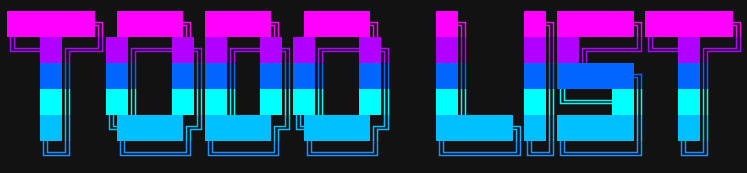
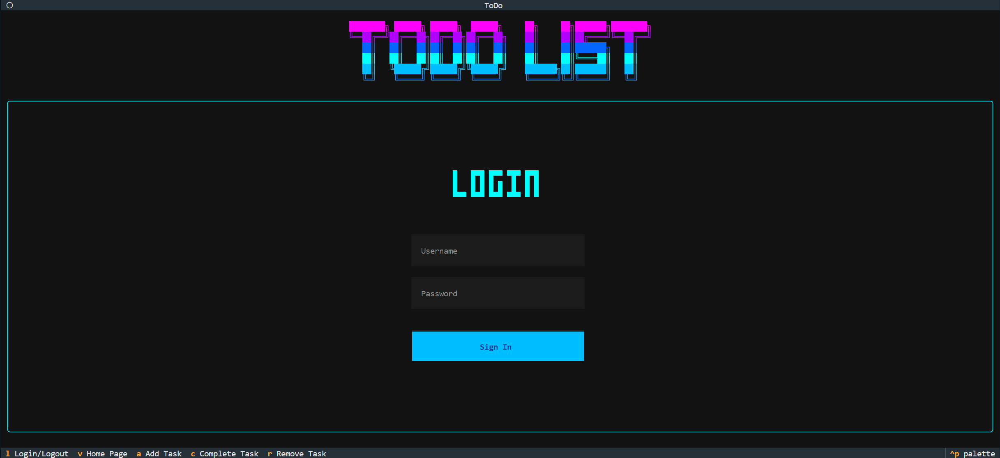
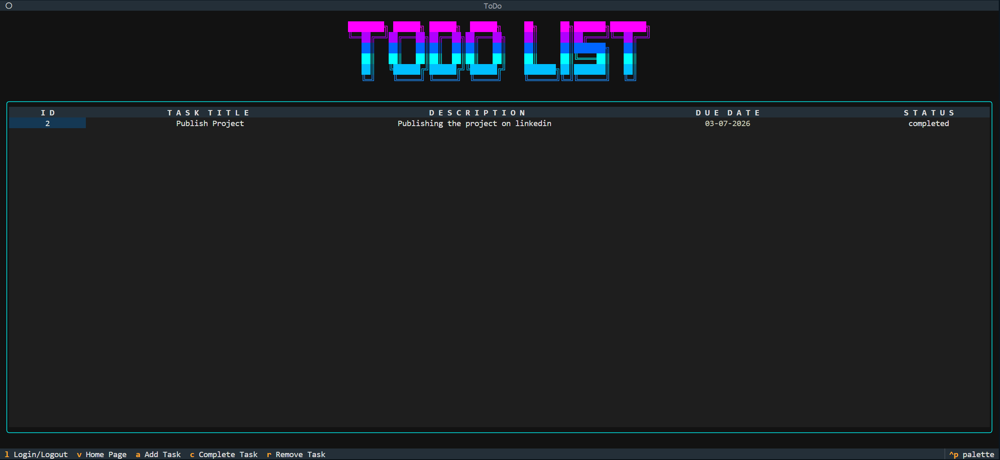
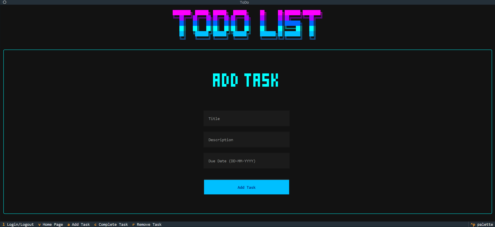
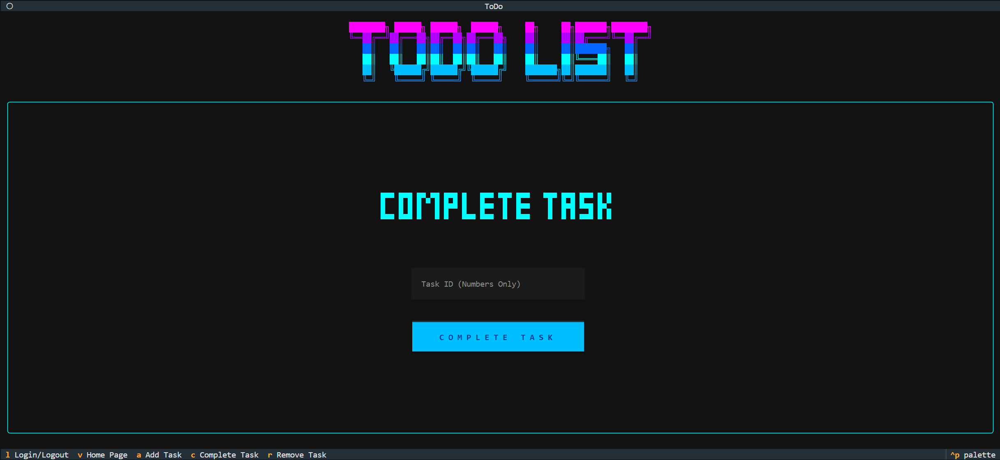

<div align="center">
  
</div>

# 📋 ToDo — Terminal Task Manager

A multi-user ToDo list application with a fully interactive terminal UI, built with [Textual](https://textual.textualize.io/). This is a ground-up rebuild of the original single-file MySQL/CLI prototype (`src/old_main.py`) — same idea, completely different app.

---

## 📸 Screenshots

**Login**



_Sign in or create an account — a new user is registered automatically the first time you use a username._

**View Tasks**



_Live, color-coded task table — green/yellow/red by due-date urgency, auto-refreshed on every change._

**Add Task**



_Enter a title, description, and due date (`DD-MM-YYYY`) to create a new task._

**Complete Task**



_Mark a task done by entering its ID._

**Remove Task**


_Delete a task by entering its ID._

---

## 🔄 What Changed From v1

The legacy version (`old_main.py`) was a linear, menu-driven CLI script: one file, MySQL backend, `input()` prompts, and Rich console printing for output.

This version is a real TUI application:

|           | v1 (Legacy)                           | v2 (Current)                                                                      |
| --------- | ------------------------------------- | --------------------------------------------------------------------------------- |
| Interface | Menu + `input()` prompts              | Interactive Textual app (keyboard-driven, mouse-friendly)                         |
| Database  | MySQL (external server required)      | SQLite (zero-config, local file)                                                  |
| Users     | Single shared task list               | Multi-user, with per-user login and isolated task tables                          |
| Structure | One script, top-level functions       | Modular: `main.py`, `widgets.py`, `database.py`, `credentials.py`, `ascii_art.py` |
| Config    | Pickled MySQL credentials on disk     | No external config — SQLite files created automatically                           |
| Output    | Static Rich tables printed to console | Live `DataTable` widget with dynamic view-switching                               |

---

## ✨ Features

- **Login system** — sign in with a username/password; a new account is created automatically the first time you use one
- **Per-user task tables** — every user gets their own isolated task table in SQLite
- **Add tasks** — title, description, and due date (`DD-MM-YYYY`), with input validation on the date field
- **View tasks** — live, color-coded `DataTable`:
  - 🟢 Green — due 7+ days out
  - 🟡 Yellow — due within the week
  - 🔴 Red — due within 24 hours
  - Auto-expires: pending tasks past their due date are automatically marked `completed` on view
- **Complete tasks** — mark a task done by ID
- **Remove tasks** — delete a task by ID
- **Responsive table** — columns re-stretch to fill the terminal on resize
- **Neon ASCII branding** — gradient logo and section headers rendered via Rich markup
- **Keyboard shortcuts** for every action (see below)

---

## ⌨️ Keybindings

| Key | Action            |
| --- | ----------------- |
| `l` | Login / Logout    |
| `v` | View Tasks (home) |
| `a` | Add Task          |
| `c` | Complete Task     |
| `r` | Remove Task       |

---

## 📦 Requirements

```bash
pip install textual rich
```

`sqlite3`, `re`, `datetime`, and `pathlib` are all part of the Python standard library — no extra install needed for the database layer.

---

## 📁 File Structure

```
ToDo/
├── data/
│   ├── credentials.db     # SQLite: users table (username, password, table_name)
│   ├── database.db        # SQLite: one table per user, holding their tasks
│   └── tasks.csv          # Legacy sample data (unused by the current app)
├── src/
│   ├── main.py            # App entry point, layout, actions, bindings
│   ├── widgets.py         # Login, Add/Complete/Remove Task, View Tasks (DataTable) widgets
│   ├── database.py        # SQLite task storage (per-user table CRUD)
│   ├── credentials.py     # SQLite user auth (create/verify users, table lookup)
│   ├── ascii_art.py       # Logo and section-heading ASCII art
│   └── old_main.py        # Legacy v1 — single-file MySQL CLI (kept for reference)
├── styles/
│   └── styles.tcss        # Textual CSS: layout, branding, controls
├── Preview/
│   └── login.png          # Screenshot of the login screen
└── README.md
```

---

## 🛠️ How It Works

### Authentication (`credentials.py`)

A single `users` table in `data/credentials.db` stores `username`, `password_hash`, and `table_name`. Logging in with a username that doesn't exist yet creates the account on the spot; logging in with an existing username checks the password. Each user is mapped to their own task table name so no one's tasks touch anyone else's.

### Tasks (`database.py`)

Each user's tasks live in a dedicated table inside `data/database.db`, created on first login (`id`, `task`, `description`, `due_date`, `status`, `created_at`). The `Database` class exposes `get_tasks`, `add_task`, `complete_task`, and `delete_task`, and can be used as a context manager.

### UI (`main.py` + `widgets.py`)

`main.py` defines the `ToDo` app: it composes the header/footer/logo/shell, wires up keybindings to action methods, and swaps whatever's mounted in the `#main` container between the `Login`, `Add_Task`, `Complete_Task`, `Remove_Task`, and `View_Tasks` widgets. `View_Tasks` renders a live `DataTable`, color-codes rows by urgency, and auto-completes overdue tasks when the table is built.

### Styling (`styles/styles.tcss`)

A structured `.tcss` stylesheet handles branding, headings, the bordered outer shell, and form control sizing/alignment.

---

## 🚀 Running It

```bash
cd src
python main.py
```

On first launch you'll land on the login screen — enter any username/password to create an account, then use the keybindings above to manage tasks.

---

## 🐛 Known Issues / Roadmap

- [ ] Task editing (currently: remove + re-add)
- [ ] Search / filter tasks by status or keyword
- [ ] Recurring tasks
- [ ] Task categories/tags
- [ ] Password hashing (currently stored as plain text — fine for local/offline use, not for anything exposed)
- [ ] CSV import/export (present in v1, not yet ported)

---

## 📝 Notes

- This app is local-first and offline — no external database server required.
- `old_main.py` is kept in the repo purely as a reference for how far the project has come; it isn't wired into the current app and isn't maintained.
- `data/tasks.csv` is leftover sample data from the v1 prototype.

---

**Last Updated**: July 2, 2026
